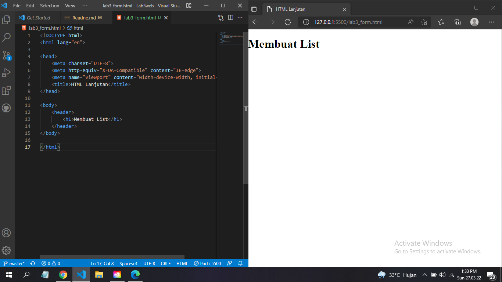
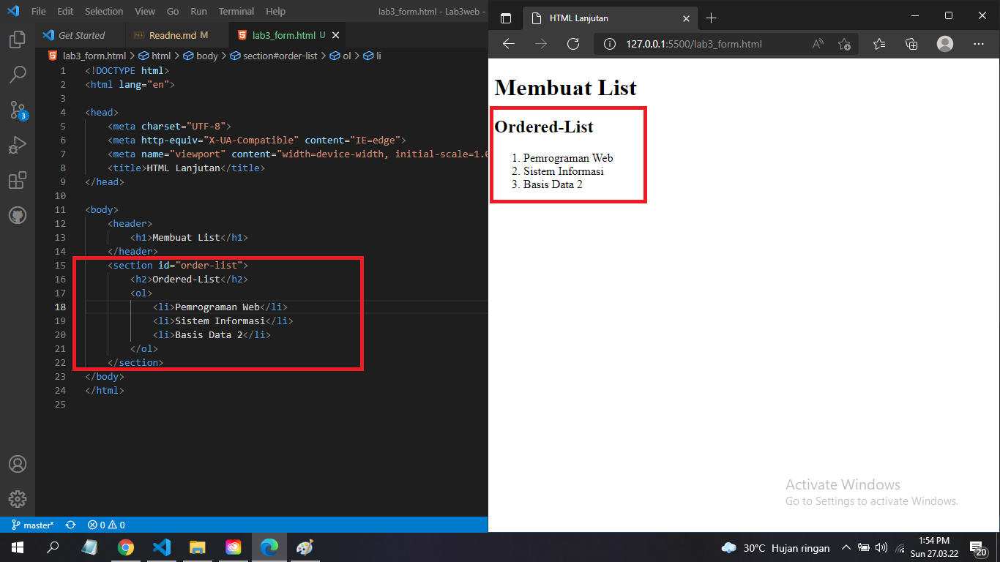
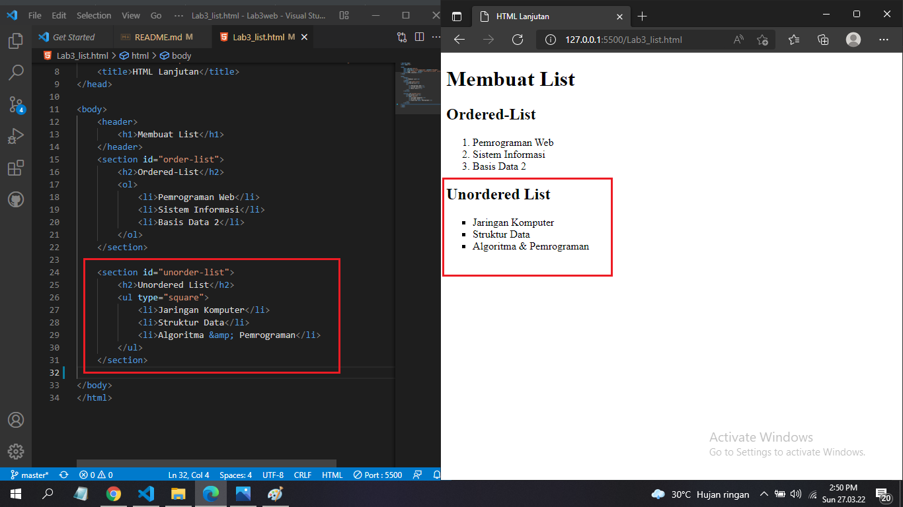
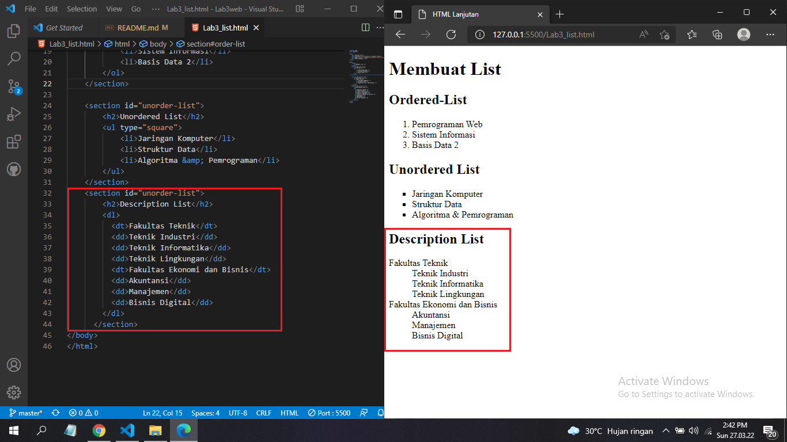
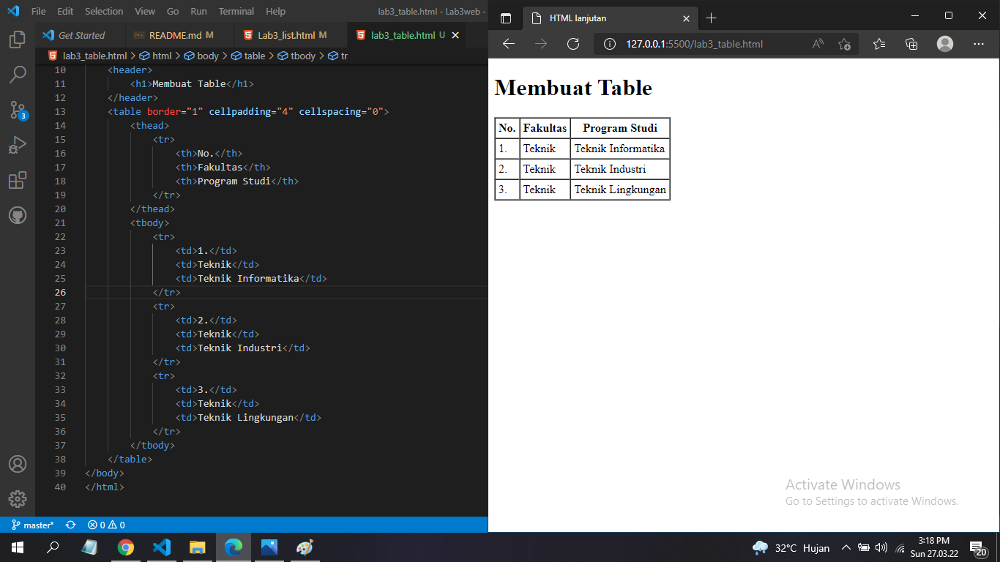
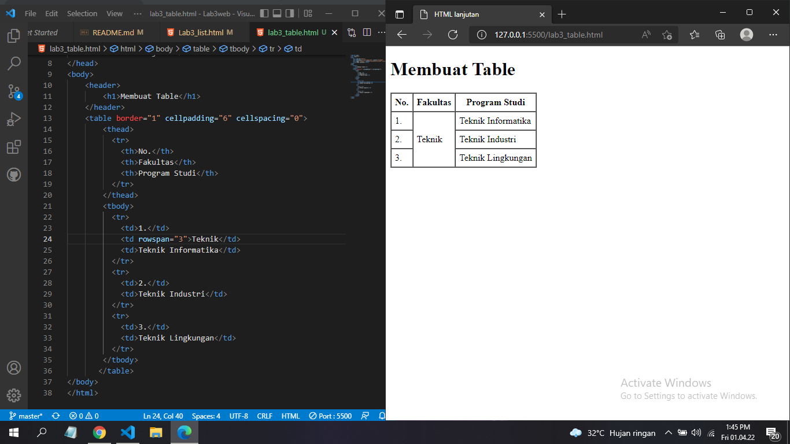
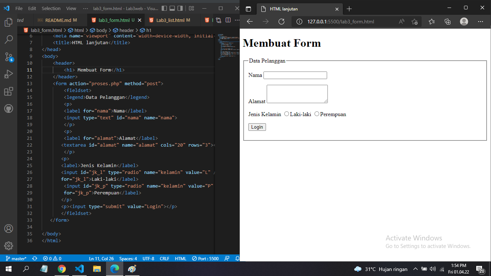

|#              |Biodata        |
|---------------|-------------- |
|**Nama**       |Rangga Saputra |
|**Nim**        |312010266      |
|**Kelas**      |TI.20.A2       |
|**Mata Kuliah**|Pemrograman web|

## Langkah 1 `persiapkan File HTML`
1. Buatlah File HTML bernama `lab3_list.html`.
2. Lalu tambahkan kode berikut.

```html
<!DOCTYPE html>
<html lang="en">

<head>
    <meta charset="UTF-8">
    <meta http-equiv="X-UA-Compatible" content="IE=edge">
    <meta name="viewport" content="width=device-width, initial-scale=1.0">
    <title>HTML Lanjutan</title>
</head>

<body>
    <header>
        <h1>Membuat List</h1>
    </header>
</body>

</html>
```
* Maka hasilnya seperti ini


## Langkah 2 `membuat ordered list`
1. Tambahkan kode `ordered list` berikut.
```html
<section id="order-list">
  <h2>Ordered List</h2>
  <ol>
    <li>Pemrograman Web</li>
    <li>Sistem Informasi</li>
    <li>Basis Data 2</li>
  </ol>
</section>
```
* Maka hasilnya akan seperti berikut


## Langkah 3 `Membuat Unordered-list`
1. Tambahkan Kode `unordered-list` berikut.
```html
<section id="unorder-list">
  <h2>Unordered List</h2>
  <ul type="square">
    <li>Jaringan Komputer</li>
    <li>Struktur Data</li>
    <li>Algoritma &amp; Pemrograman</li>
  </ul>
</section>
```
* Maka hasilnya seperti berikut.


## Langah 4 `Membuat Description list`
1. Tambahkan kode `description list` berikut.
```html
<section id="unorder-list">
  <h2>Description List</h2>
  <dl>
    <dt>Fakultas Teknik</dt>
    <dd>Teknik Industri</dd>
    <dd>Teknik Informatika</dd>
    <dd>Teknik Lingkungan</dd>
    <dt>Fakultas Ekonomi dan Bisnis</dt>
    <dd>Akuntansi</dd>
    <dd>Manajemen</dd>
    <dd>Bisnis Digital</dd>
  </dl>
</section>
```
* Maka hasilnya akan seperti berikut


## Langkah 5 `Membuat Table`
1. Membuat File baru bernama `lab3_table.html`.
2. Tambahkan kode `table` berikut.
```html
 <table border="1" cellpadding="4" cellspacing="0">
        <thead>
            <tr>
                <th>No.</th>
                <th>Fakultas</th>
                <th>Program Studi</th>
            </tr>
        </thead>
        <tbody>
            <tr>
                <td>1.</td>
                <td>Teknik</td>
                <td>Teknik Informatika</td>
            </tr>
            <tr>
                <td>2.</td>
                <td>Teknik</td>
                <td>Teknik Industri</td>
            </tr>
            <tr>
                <td>3.</td>
                <td>Teknik</td>
                <td>Teknik Lingkungan</td>
            </tr>
        </tbody>
    </table>
```
* Maka hasilnya akan seperti ini.


# Langkah 7
## Menggabungkan sel data
``` html
<table border="1" cellpadding="6" cellspacing="0">
    <thead>
      <tr>
        <th>No.</th>
        <th>Fakultas</th>
        <th>Program Studi</th>
      </tr>
    </thead>
    <tbody>
      <tr>
        <td>1.</td>
        <td rowspan="3">Teknik</td>
        <td>Teknik Informatika</td>
      </tr>
      <tr>
        <td>2.</td>
        <td>Teknik Industri</td>
      </tr>
      <tr>
        <td>3.</td>
        <td>Teknik Lingkungan</td>
      </tr>
    </tbody>
   </table>
```
* Maka hasilnya akan seperti berikut 


# Langkah 8
1. Membuat dokumen HTML baru dengan nama file `lab3_form.html` dan Buat Tabel

``` html
 <form action="proses.php" method="post">
         <fieldset>
         <legend>Data Pelanggan</legend>
         <p>
         <label for="nama">Nama</label>
         <input type="text" id="nama" name="nama">
         </p>
         <p>
         <label for="alamat">Alamat</label>
        <textarea id="alamat" name="alamat" cols="20" rows="3"></textarea>
         </p>
        <p>
        <label>Jenis Kelamin</label>
        <input id="jk_l" type="radio" name="kelamin" value="L" /><label
        for="jk_l">Laki-laki</label>
         <input id="jk_p" type="radio" name="kelamin" value="P" /><label
         for="jk_p">Perempuan</label>
        </p>
        <p><input type="submit" value="Login"></p>
        </fieldset>
    </form>
```
* Maka hasilnya akan seperti ini
